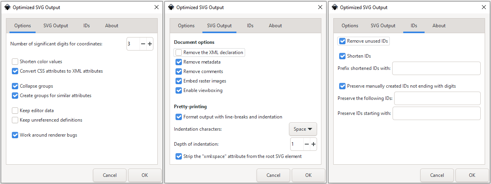

# Guide for optimizing SVG icons for fasteners workbench

This guide is written for INKSCAPE editor version 1.1 or higher.

## 1. Save icons as Optimized SVG file.

Save icons by **"File → Save As..."** menu item. File type select as: **Optimized SVG (*.svg)**

In opened window select next options:

That must decrease size of *.svg file to 40-60%.

## 2. Use one solid contour instead fill instrument.

After you have created the outline of your fastener and opened it in the inkscape editor, you need to give it a color. Beginners usually use the tool 
 **Fill bounded areas (U)** it's simple and intuitive. Each such fill creates a separate path (shape) from a set of points. Fill created in this way takes up a lot of space in the final file.
 
This can be solved in two ways:
1. Create several shapes ellipses circles rectangles so that they run into each other and union them into one big path by 
 command.
2. Create path manually by  **Draw Bezier curves and straight lines (B)** tool.

## 3. Simplify curve paths.

Select curve and press **CTRL+G** or menu item **Path → Simplify** 

## 4. Join paths.

Paths that have points of contact should be combined into longer paths.

Switch to "Edit paths by nodes" mode by pressing 
 button or press **N key** on keyboard.
Select two separated paths. Hold down the CTRL key and select two points by selection rect where paths are contacted.
Press 
 button to join paths.

## 5. Use XML Editor. Remove garbage tags and attributes.

Remove unneeded attributes too. Like sodipodi, font attributes etc...

**Next methods needs use XML editor.**

## 6. Get rid of the matrix() and translate() attributes.

Select the subgroup that contains this attribute.
Make Ungroup operation by press SHIFT+CTRL+G keyboard key combination or through **Object → Ungroup** menu item
